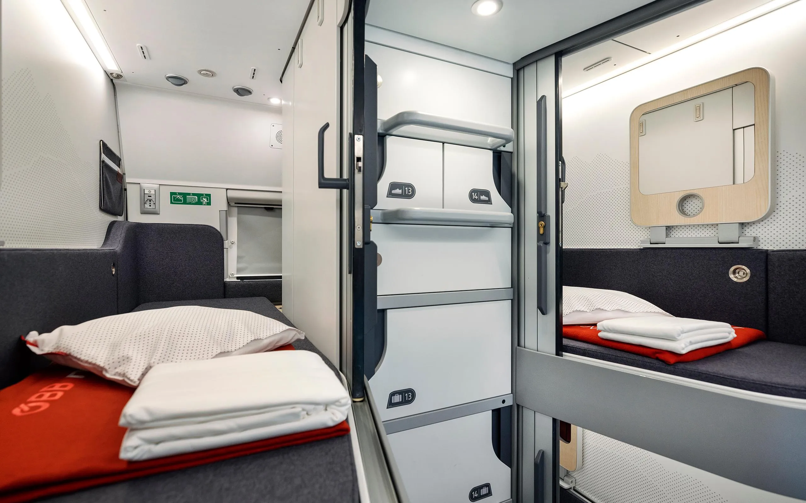

# A light of hope for trains against planes?

In a previous article, I dove into the perplexing world of train prices, lamenting how they just can't seem to get their act together to compete with the allure of flying. Despite the environmental guilt that nags at us every time we book a flight, the wallet often wins the battle when it comes to choosing between the sky and the tracks. But there might just be a glimmer of hope on the horizon, and it comes in the form of cozy little pods on wheels.

Yes, you heard me right. Night trains are making a bit of a comeback, trying to hype us with the promise of waking up fresh in a new city. But let's be real, they've not been aluring. A night on these trains often cost more than a flight and a fancy hotel combined.

Enter Nightjet, the European company that seems to have borrowed a page from Japan's playbook. They've rolled out a ["Mini cabin"](https://www.nightjet.com/komfortkategorien/liegewagen#minicabin) class that's like a capsule hotel on rails. These little pods of privacy offer a bunch of perks: your own space without a bunk bed buddy, secure luggage storage, and enough room to stretch without bonking your head. They've even thought about the lovebirds among us, with pods that have small connecting doors.

At 120 euros per person, it's not dirt cheap, but it's also not going to break the bank. And there's more: if you've got an international EU train pass like Eurail, you can snag an 80-euro discount on these cabins. Suddenly, you have a competitive, cozy way to travel around europe that will fit into a larger journey.

So, are these cozy pods enough to tip the scales in favor of trains? Maybe not entirely, but they're certainly a step in the right direction. It's about making greener choices more accessible and appealing to the masses. And who knows? With more innovations like this, we might just find ourselves choosing tracks over tarmac more often. In the battle of trains against planes, it seems there's finally a light of hope flickering in the distance.
