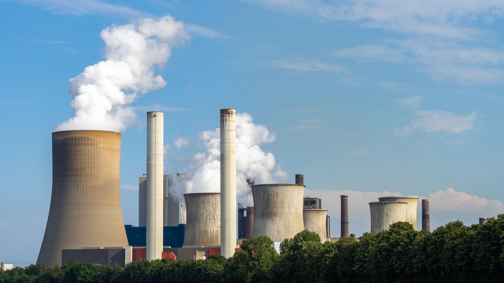

# Germany spent more and polluted more

Here is the number that reframed how I read energy news. In 2025, Germany's electricity was **330 grams of CO2 per kilowatt-hour**. France's was **41**.

Eight times cleaner. Not eight percent, eight times.

Rank European countries on climate ambition from a decade of headlines and Germany lands near the top. On installed capacity, on political commitment, on money spent, it belongs there. On the number that decides whether the atmosphere notices, it does not.

## The one chart that explains European electricity

These are the 2025 carbon intensities of European grids, in grams of CO2 per kilowatt-hour, from [Ember's data](https://ourworldindata.org/grapher/carbon-intensity-electricity):

| Country     | gCO2/kWh (2025) | What runs the grid                    |
| ----------- | --------------- | ------------------------------------- |
| Norway      | 28              | 90% hydro                             |
| Sweden      | 35              | 40% hydro, 28% nuclear                |
| Switzerland | 39              | hydro and nuclear                     |
| France      | 41              | 69% nuclear                           |
| Finland     | 57              | 40% nuclear, 27% wind                 |
| Slovakia    | 95              | nuclear                               |
| Denmark     | 114             | 58% wind, 13% solar                   |
| EU average  | 210             | mixed                                 |
| Germany     | 330             | 27% wind, 18% solar, 37% coal and gas |
| Poland      | 589             | 50% coal                              |

One pattern jumps out. **Every European grid below 100 gCO2/kWh runs on hydro, nuclear, or both.** No exceptions.

This is where energy arguments usually turn tribal, so let me be precise. The claim is not that wind and solar fail. It is narrower: **as of 2025, nobody has gotten below roughly 100 grams without a large dispatchable low-carbon fleet.** Hydro where geography grants it, nuclear where politics allowed it.

## Denmark is the honest test case

To see how far wind and solar can carry a grid, do not look at Germany. Look at Denmark.

Denmark generates **58% of its electricity from wind and 13% from solar**: 71% from variable renewables, the highest share in Europe, built on three decades of political consistency. It is the best-executed version of the strategy that exists.

Denmark's grid is **114 gCO2/kWh**. That is a remarkable achievement (314 in 2015, so nearly two thirds cut in a decade) and still **2.8 times France's 41**.

The last 29% is why. When the wind drops, something has to run, and in Denmark that something is gas, biomass, and imports. The first 70% turns out to be much easier than the next 20%, and nobody in Europe has closed that gap with weather-dependent generation alone.

So we're done here, right? Build reactors, go home? Not quite. But the German case deserves specifics first.

## The dimension nobody puts in the headline: size

Denmark can do what Germany cannot, and it has little to do with Danish competence (real) or German incompetence (mostly a myth). It is arithmetic about size.

Denmark consumes about **36 TWh a year** and peaks around **7 GW**. High wind, it exports. Low wind, it imports. Its [interconnection ratio is 36.5%](https://energy.ec.europa.eu/topics/infrastructure/electricity-interconnection-targets_en), one of Europe's highest, against an EU target of 15%. On the other end of those cables sits Norway, whose reservoirs hold [about 87 TWh](https://energifaktanorge.no/en/norsk-energiforsyning/kraftproduksjon/), roughly half of all electricity storage in Europe.

Put those two numbers together. **Norway's reservoirs store about two and a half times Denmark's entire annual electricity consumption.** Denmark is not running a 71% variable-renewable grid. It is running one plugged into a battery larger than itself, and paying Norway for the service.

Now scale that up. The same 87 TWh is **19% of Germany's annual consumption** (466 TWh in 2025) and roughly **3% of the EU's**. The pool is fixed: Norway's mountains are not getting deeper, and Europe's total reservoir capacity of 180 to 220 TWh is what geology handed us.

So interconnection does not scale, it dilutes. A small country can always find a bigger neighbour. Germany, at thirteen times Denmark's consumption, is already too big for the neighbours it has: interconnection ratio **10.2%**, below the EU target, and a net importer since 2024. And Europe as a whole cannot import from itself.

### Overbuild is the price of the last 30%

The second half of the size problem shows up on the balance sheet.

Weather-dependent generation means overbuilding. Covering the calm, dark stretches takes far more capacity than average demand requires, and that surplus does not vanish on the good days. It arrives all at once, across the whole weather system, and it has to go somewhere.

Germany's 2025 receipts:

- **539 hours of negative day-ahead prices**, a national record, hours when the market was paying people to stop generating
- **Solar curtailment up 94% year on year**, with a third of renewable redispatch now caused by congestion in distribution networks rather than the transmission grid
- **€435 million** in [curtailment compensation](https://www.cleanenergywire.org/news/renewable-curtailment-compensation-costs-germany-decrease-22-2025), paid for electricity nobody used
- **About 30 TWh** of total grid congestion management measures, roughly flat on 2024

The surplus scales with the grid. The places to put it do not. Denmark's excess wind is a rounding error to the Nordic system. Germany's excess solar at noon in June is tens of gigawatts arriving at neighbours who are also sunny, also at noon. Weather correlates across a continent; demand does not.

So how much storage would close the gap? Germany consumes roughly **9 TWh in an average week**. Europe's entire battery fleet, after a record 2025, is about **0.1 TWh**, a bit over **1% of a single German week**.

That comparison is easy to abuse, so let me be fair. Batteries are not trying to cover a week. They are excellent at the daily cycle, moving solar noon into the evening peak, which is why they are being built so fast. But annual carbon intensity is decided by the **Dunkelflaute**, the still, overcast winter week when wind and solar both go quiet. Covering that with batteries means terawatt-hours, and the bigger the grid, the more terawatt-hours it means.

France's 69% nuclear never has to solve that problem. Neither does Norway's 90% hydro. Both are dispatchable, both are weather-independent on the timescale that matters, and both were built once.

## Germany did build the renewables. That is what makes it interesting

Germany's 2025 mix: **27.2% wind, 17.9% solar**, so 45% variable renewables. France, the clean-grid poster child, gets **14%**.

Three times more variable renewables than France, as a share of the grid. Eight times the carbon intensity.

The rest of the mix explains it. Germany still generates **20.6% from coal and 16.5% from gas**. Fossil fuels are 37% of the grid, and coal is the specific problem, because German coal includes lignite, roughly the dirtiest fuel available anywhere. France burns coal for **0.3%** of its electricity.

The progress is real. Germany went from **504 gCO2/kWh in 2015 to 330 in 2025**, a 35% cut, a drop larger than France's entire current intensity. Anyone claiming the Energiewende achieved nothing is not looking at the data.

The problem is where it landed. Germany's power sector emitted about **188 million tonnes of CO2 in 2023, roughly 29% of all EU electricity emissions**, the largest share of any member state. Poland, Europe's designated coal villain, emitted **112 million tonnes, about 17%**.

People get this comparison wrong in both directions, so precisely: **per kilowatt-hour, Germany's grid is far cleaner than Poland's** (330 against 589). But Germany's grid is much larger, so in absolute tonnes, which is what the atmosphere integrates, Germany is Europe's biggest power-sector emitter by a wide margin.

Then there is the money. Germany's economy minister estimated in 2013 that the Energiewende could reach [around one trillion euros by the end of the 2030s](https://www.cleanenergywire.org/factsheets/how-much-does-germanys-energy-transition-cost), citing roughly €680 billion already committed through 2022. Annual renewables support ran around €25 billion. Nuclear decommissioning and waste storage add more than €65 billion.

For scale: EDF's provisional cost for [six new EPR2 reactors is €72.8 billion](https://www.sfeninenglish.org/epr2-programme-cost-cap-six-reactors-france/), and the Cour des comptes expects [more than €100 billion](https://energynews.oedigital.com/nuclear-power/2025/11/17/court-of-auditors-says-that-edf-fleet-maintenance-will-cost-more-than-100-billion-euros-by-2035) to keep the existing French fleet running to 2035. Not like-for-like (decades of generation subsidy against capex for plants that do not exist yet, neither including the grid), but the orders of magnitude are hard to ignore.

## The nuclear exit, fairly

On 15 April 2023, Germany shut its last three reactors. They had produced just under **30 TWh** in their final year.

Everyone predicted coal would fill the gap. I did too. It did not: 2023 saw Germany's [lowest coal use in six decades](https://www.cleanenergywire.org/factsheets/qa-germanys-nuclear-exit-one-year-after), as demand fell, renewables grew, and imports rose. The "they replaced nuclear with lignite" story is wrong, and I would rather say so than repeat a claim that suits my argument.

The honest version is a counterfactual. Those 30 TWh were carbon-free and already paid for. Keeping them would not have stopped a single turbine being built; it would have displaced 30 TWh of something else, and in a 37% fossil grid that something else burns carbon. The choice was never nuclear or renewables. It was nuclear or coal, and Germany put fossil fuels last.

The irony isn't lost on me: the country that shut working zero-carbon reactors in 2023 is still, in 2026, arguing with itself about when to stop burning lignite. The law says **2038**, the coalition wants **2030**, RWE has agreed to 2030 for its plants, about **33.6 GW** of coal capacity has already retired, and the first official [stocktake](https://www.agora-energiewende.org/news-events/whats-the-timeline-for-germanys-coal-phase-out) is due this year.

## Why the grid decides everything downstream

Here is why intensity deserves more attention than capacity.

Every serious plan for transport, heating, and industry is an electrification plan. Electric cars instead of combustion, heat pumps instead of gas boilers, arc furnaces and hydrogen instead of coke. Move demand onto the grid, because a grid can be cleaned centrally and a hundred million tailpipes cannot.

So the emissions you save by electrifying anything are exactly as good as the grid it plugs into. Take an electric car using 18 kWh per 100 km at the wall:

- In France: **7 gCO2/km** from electricity
- In the EU on average: **38 gCO2/km**
- In Germany: **59 gCO2/km**
- In Poland: **106 gCO2/km**

Same car, same battery, same factory, and a fifteen-fold spread depending on the socket. The [ICCT's 2025 lifecycle analysis](https://theicct.org/publication/electric-cars-life-cycle-analysis-emissions-europe-jul25/) puts a European battery electric car at **63 gCO2e/km against 235 for petrol**, a 73% cut, with the manufacturing penalty repaid after about 17,000 km. Every one of those numbers improves on a clean grid.

To be fair to electrification: a heat pump at a coefficient of performance of 3 beats a gas boiler even on German electricity, roughly 110 grams per kWh of heat against 220 for gas. Electrification is not a bad bet on a dirty grid. It is a much better one on a clean grid, and the sequence decides how much reduction each euro buys.

## The strongest case against me

I would be doing this badly if I stopped here. The arguments against my conclusion get stronger every year.

**Timelines.** A reactor ordered today does not generate before the late 2030s. Flamanville 3 took seventeen years. EPR2 has already crept €5.4 billion above the Cour des comptes estimate, and the auditors doubt the schedule. A 2035 target is not helped by a plant that arrives in 2040.

**France is no free lunch.** In 2022, stress corrosion cracking took up to **32 of 56 reactors offline** at once and output collapsed from 379 TWh to about 280, the worst in decades. French intensity jumped from 53 to 79 grams in a single year. Average fleet availability from 2014 to 2024 was **74%**. A grid built on one technology has a correlated failure mode, and France found it.

**Storage is moving fast, which is exactly what threatens my size argument.** Stationary packs fell to [about $70/kWh in 2025, down 45% in a year](https://about.bnef.com/insights/clean-transport/new-record-lows-for-battery-prices/), and Europe [added 36 GWh to pass 100 GWh operational](https://www.solarpowereurope.org/press-releases/new-report-eu-installs-27-1-g-wh-of-new-batteries-in-2025-as-utility-scale-storage-drives-record-growth), heading for perhaps 138 GWh a year by 2030. Extend that curve and the daily cycle stops being a problem, which removes the noon-surplus half of the overbuild case.

The week-long Dunkelflaute would still need answering, and not necessarily with lithium: hydrogen, iron-air, thermal storage, demand response from electrified heating and vehicles, or simply far more interconnection than Germany's 10.2%. If any of those arrive at scale this decade, Denmark's 114 grams is a waypoint rather than a ceiling, and my table ages badly. That is the biggest uncertainty in European energy policy right now, and I would rather be wrong about it than right.

## What I take from it

My frustration is not with renewables, and certainly not with technology. Solar got cheap faster than almost anyone predicted, which is one of the best things that happened this century.

My frustration is that we measured the wrong thing for twenty years. Installed capacity, gigawatts deployed, generation records on sunny windy afternoons: visible, announceable, celebrated. The number that decides whether any of it helps, grams of CO2 per kilowatt-hour, stayed in the appendices. A country spent close to a trillion euros and arrived at eight times its neighbour's emissions.

So before congratulating yourself on your electric car or your new heat pump, look up your grid's carbon intensity. It is published, it is comparable, and unlike almost everything else in this debate, it is very hard to spin.
