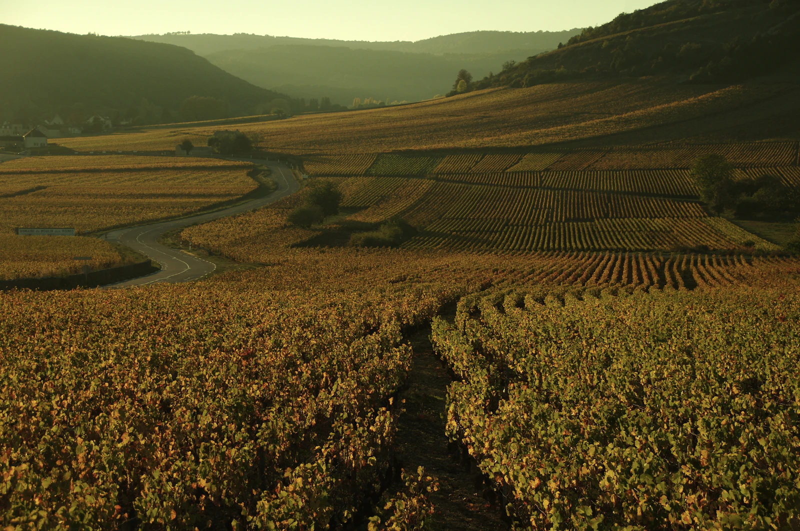

# Glam-hiking: a week on foot with a fanny pack

I already wrote about [traveling with a 35L backpack](/blog/the-freedom-of-a-small-backpack/), and I thought that was the end of the story. It wasn't. On my last multi-day hike I carried a fanny pack. Four days on the GR59 through the Jura vineyards, and everything I needed fit around my waist.

I call it glam-hiking, and I find it remarkable how few people know it's an option.

## The equipment you carry is mostly there for the equipment you carry

Traditional long-distance hiking has a compounding problem. You carry a tent, so you carry stakes and a footprint. You sleep outside, so you carry a sleeping bag and a mat. You have no kitchen, so you carry a stove, fuel, a pot, and three days of food. You now weigh **twelve to fifteen kilos** heavier, so you need sturdier boots, more water, and a bigger pack with a real hip belt to hold it all. Every solution buys you a new problem.

Cut the first assumption and the whole stack collapses. Sleep in hotels and campsites with actual beds. Eat what you buy that morning, or eat at a restaurant. Now you are carrying clothes, a raincoat, and water. That is a hip pack, not an expedition.

Here is what I actually took to the Jura for four days:

- 1 legging short
- 1 sun hoodie
- 1 pair of pants
- 2 underwear
- 2 pairs of merino socks
- 1 down jacket, 1 raincoat
- Water bottle

That's it. The laundry strategy is the trick that makes it work: wash everything in the sink every evening, and they are dry by morning. I tested this first in Alsace and it held up for a full trip. Two of everything is enough when everything dries overnight.

## What I gave up, honestly

I want to be fair about the trade-offs, because "just book hotels" sounds like a way of saying "just have money".

**It costs more.** A bed and a dinner every night is not free. On the other hand, I did not buy a tent, a sleeping bag, a mat, or a stove, and I am not replacing them every few years.

**It constrains the route.** You cannot walk wherever you want. Every day has to end somewhere with a bed, which means the trail is planned around villages rather than summits. Some of France's best ridgelines are simply not glam-hikeable.

**It is not wilderness.** If your reason for hiking is to be far from everyone, this is the wrong way to do it. I sleep in villages, I eat in restaurants, and on the Alsace trip I stopped for wine tastings on the way. That is a feature for me and a disqualification for someone else.

What strikes me is how much the discomfort was doing nothing for me. The heavy pack was not making the walk more meaningful, it was just making it harder. For a lot of hikes, I am happy to trade weight and pass on inaccessible trails.

## The rules I converged on

Four trips in, this is the version that works.

**Sixteen kilometers a day on flat terrain, twelve to fourteen if you are two.** Pace matters more than distance. In Alsace I learned that twelve to fourteen flat kilometers is a good rhythm for a couple, because you stop more, you talk more, and you are not racing a hotel check-in time.

**Shower immediately at the end of the day.** Not after a drink, not after checking in slowly. Chafing is a salt and friction problem and it compounds day over day.

**Always know the bail-out.** This is the rule I care about most. Before I commit to a section, I check what else leaves from the villages along it: a TER, a bus, anything. On the GR59, Poligny, Domblans and Saint-Lothain have trains, and Crancot has buses if you read the timetable carefully (they are rare). If I twist an ankle on day two, I want the day to end with a train ride, not a rescue.

That last rule is the one that quietly reshapes everything. Once "can I leave from here" becomes a hard constraint, you stop planning hikes around trailheads and start planning them around stations.

## Trains are the actual unlock

Every glam-hike I have done starts and ends at a train station. Obernai to Ostheim through the Alsace vineyards. Arbois to Lons-le-Saunier along the GR59. No car shuttle, no parking at one end and hitchhiking back, no loop forced on the itinerary just to return to a vehicle.

Point-to-point hiking is strictly better than loops, and a car makes point-to-point annoying. A train makes it trivial. You walk in one direction for four days, and the way home is a platform.

The irony isn't lost on me: I have spent time writing about how [European train pricing](/blog/the-nonsense-of-train-prices/) makes rail lose to flying, and here the train is the thing that makes the whole trip possible. TER regional tickets are cheap, frequent enough, and go to villages no airline or bus will ever carry you to.

Which raises the question I could not answer from a map: how many French trails actually start and end at a station? I tried planning a few of these by hand, cross-referencing GR routes against timetables, and it was miserable. So I built something to answer it properly, and the answer surprised me.

*More on that next.*
