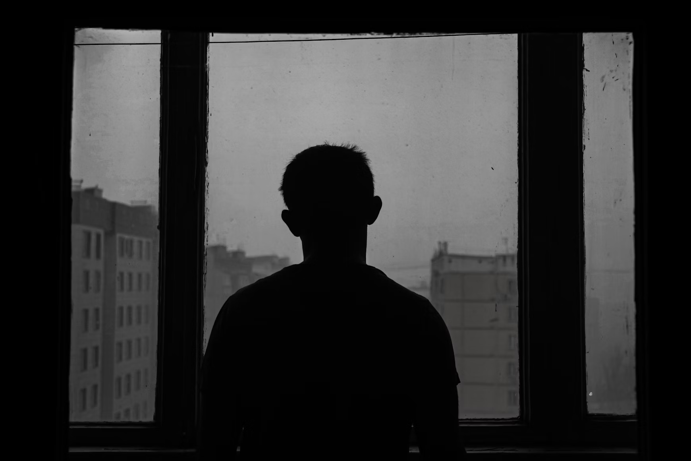
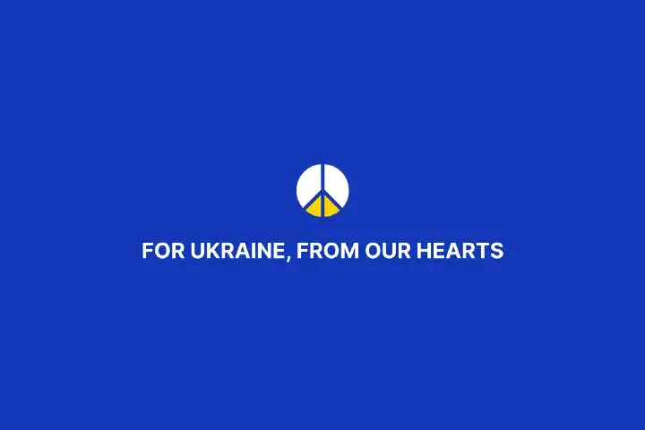

# Making a difference in order to save your mental health

_EDIT: It appears following some complications ranging from exauhstion to lack of volunteer that the NGO as ceased their
operations for now. My points about helping other still remains valid though, and I encourage you to go out their and
help others to help yourself._

Having family, friends, and bounds in both Ukraine and Russia, I closely followed the military buildup at the western
Ukrainian border throughout the end of 2021. Deep down, I knew that such a buildup could not just be for show, but I
still refused to believe it.

**I was wrong.**

On the morning of Monday the 28th, I nearly collapsed crying in front of my computer while trying to get some work done.
After struggling to sleep and coping with the weight of all this stress, I just could not continue.

My mentor told me to take some time off, that everything would be handled, and that I should disconnect for a while.
While his behavior and handling of the situation were exemplary, it did not solve my mental struggle. I was still
feeling conflicted, powerless and terrorized for Ukraine.

While looking for something to do to help during my time off, I came upon
the [Ukraine Global Taskforce](https://ukraineglobaltaskforce.com/) (that I will mostly refer to as UGT in the rest of
this article). At the time, it was just a group of strangers coming together to help Ukrainian with their main skills:
building tech products. It was not even an NGO, and was just a group of 150 people on a Discord server. After a quick
message to the founder on LinkedIn, I was ready to help them by offering my only useful skill for this situation: my
developer experience.

[Ukraine Global Taskforce](https://ukraineglobaltaskforce.com/) is now an official NGO, uniting more than a thousand
volunteers from around the world. Instead of directly contributing to the relief effort, it leverages its member skills
to build digital products in order to help established NGOs to achieve their mission faster and more efficiently. We
developed logistic tools to help distribute food and material to Ukrainian in need, tools to spread information about
sheltering options, or provide targeted help to groups in need in and outside Ukraine.

At the end of my time off, I still wanted to continue contributing to the various projects UGT has started off. I was
ready to take some unpaid leave from my work to dedicate time to these projects, but my company stepped forward. I
currently work for a French Health company named [Alan](https://alan.com/). Everyone there felt affected by the horrors
unfurling in Ukraine. We quickly gave free access to our mental health app, [Alan Mind](https://mind.alan.com/), to
Ukrainians, both in and outside Ukraine. **While this was a great first step, my company also agreed to donate 6 days of
my work to UGT without any pay cut.**

I cannot understate the impact this had: It allowed me to work full time on the project. And I became one of the most
active engineers at the time, without having to worry about providing for my family. Because of this, we greatly sped up
multiple projects and provided tools for NGOs and Ukrainians faster. While a small sacrifice for the company, this
allowed UGT to ramp up its digital development a lot and shaved several days off the release of potentially life-saving
tools.

**Allowing employees to help NGOs by donating work time is a clear and efficient way for companies to get involved with
the relief effort.** I greatly encourage every company that can afford to do so to follow this path. Not only do you
help people in need, but also help your employees feel valuable, listened to, and cherished.

Now, did my time spent at UGT help Ukrainians in need? It’s hard to say. For all I know, my impact might be minimal, as
this is hard to judge and quantify in the current situation. On the other hand, the positive impact it had on myself was
really clear: It gave me a sense of purpose and was an important drive in my recovery.

**If you feel downed by the current situation, political or health-wise, try volunteering.** It might sound selfish to
put it this way, but while helping others, you will also help yourself. I think it’s clearly a win-win that a lot more
people should give a try to. Any skills are welcome, even just reposting messages asking for help is already a big
contribution.

I want to finish this piece with a sincere “Thank you” to the numerous members of UGT. Seeing your drive and dedication
was a real blast and really helped me get back on my feet.

If you also want to contribute to this project, please get involved
through [their website](https://ukraineglobaltaskforce.com/) and help save lives ❤️
