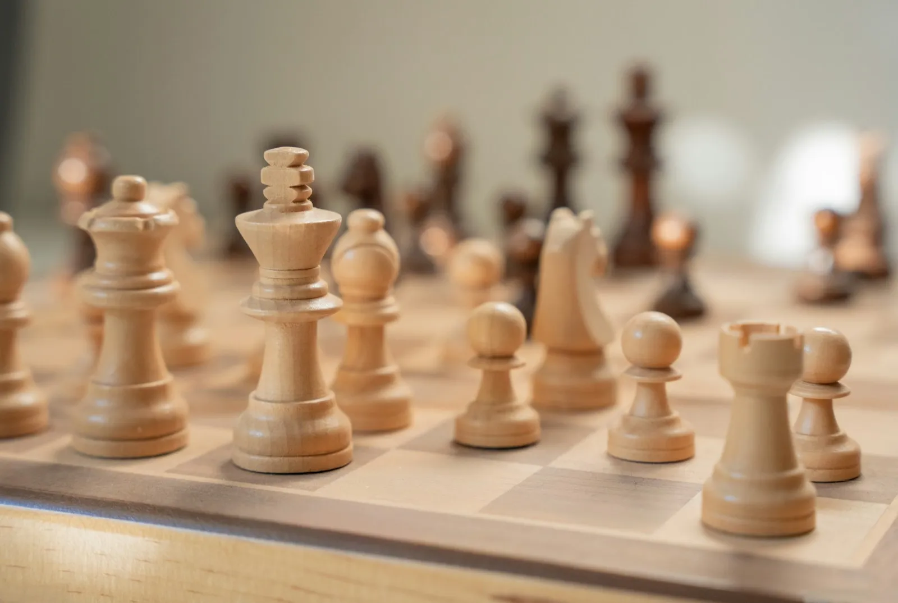

# My first shitty playable bot

There's a specific moment in building a chess engine where it goes from a legal move generator to something that actually *plays chess*. It doesn't play well, it plays terribly, in fact, but it makes moves that have intent behind them. It tries to capture your pieces. It occasionally stumbles into a checkmate. That moment is magic, and it came sooner than I expected.



## The simplest possible search

The idea behind all chess engine search is minimax: you assume both players play optimally, and you pick the move that leads to the best outcome for you assuming your opponent also picks their best moves. At depth 1, you just evaluate every legal move and pick the highest-scoring one. At depth 2, you evaluate every response to every move. At depth 3, every response to every response. It explodes exponentially, which is why nobody actually implements it this way.

**Negamax** is the same idea reformulated so you only need one function. Instead of alternating between "maximize for white" and "minimize for black," you always maximize, but negate the score when switching sides. If a position is +100 for white, it's -100 for black. One function, one sign flip.

Here's the core idea, simplified:

```
fn negamax(depth, alpha, beta) -> score:
    if depth == 0:
        return evaluate()

    for each legal move:
        make_move()
        score = -negamax(depth - 1, -beta, -alpha)
        undo_move()

        if score > alpha:
            alpha = score
        if alpha >= beta:
            break  // beta cutoff
    return alpha
```

The `alpha` and `beta` parameters are the key insight: **alpha-beta pruning**. Alpha is the best score the current player can guarantee. Beta is the worst score the opponent will accept. If you find a move that scores above beta, you can stop searching this node entirely: the opponent would never allow this position to be reached, because they already have a better option elsewhere.

Alpha-beta doesn't change the result compared to plain minimax. It just finds the same answer faster by skipping branches that can't affect the outcome. In practice, with good move ordering, it roughly squares the depth you can search in the same time: depth 8 with alpha-beta takes about as long as depth 4 without it.

## The horizon effect and quiescence search

The first version of Oxide's search had a brutal problem: it would happily walk into a losing trade because the capture response was beyond its search depth. It would sacrifice its queen for a pawn, because at depth 5 it saw "I capture a pawn, I'm up material!" without seeing the immediate recapture.

This is the **horizon effect**. The engine's search has a horizon, the maximum depth, and anything beyond it is invisible.

The fix is **quiescence search**. At the leaves of the main search, instead of returning the static evaluation immediately, you continue searching all captures, promotions, and en passant moves until the position is "quiet." No hanging pieces, no obvious tactical sequences left unresolved.

Quiescence search uses a **stand-pat** score as a baseline: the static evaluation of the current position. If the stand-pat already beats beta, the position is good enough without capturing anything. This prevents the search from exploding, since most quiet positions have few captures available.

## Hashing what you've already seen

Even with alpha-beta, the same positions come up over and over. The move sequence 1.e4 e5 2.Nf3 arrives at the same position as 1.Nf3 e5 2.e4, but without some form of memory, the engine would search both completely from scratch.

The **transposition table** (TT) is a hash table keyed by a **Zobrist hash**, a 64-bit number that uniquely identifies a board position. Each time the search finishes evaluating a node, it stores the result: the hash key, search depth, score, best move found, and what kind of node it was (exact score, lower bound, or upper bound).

Before searching any position, the engine checks the table. If there's a match at sufficient depth, it can use the stored score directly, or at minimum, use the stored best move to search it first, which dramatically improves alpha-beta cutoff rates.

Oxide's TT defaults to 16 MB. Each entry stores the Zobrist key, depth, score, best move, and node type. Replacement policy is simple: deeper entries are preferred, but same-key entries always get replaced.

## The Search struct

In Oxide, the `Search` struct owns everything it needs:

```rust
pub struct Search {
    pub position: Position,
    pub movegen: Movegen,
    pub eval: Eval,
    pub nnue: NnueEval,
    pub nodes_searched: usize,
    killers: [[Move; 2]; 128],
    history: [[i32; 64]; 64],
    lmr_table: [[u8; 64]; 128],
    // ...
}
```

Position handles the board state and do/undo move. Movegen generates legal moves. Eval (and later NNUE) scores positions. The killers, history, and LMR tables are all move ordering and reduction heuristics that came later, in the first playable version, most of these were empty.

## Watching it play

The first time I loaded Oxide into a chess GUI and played against it, it was comically bad. It could see about 5-6 plies deep, which sounds reasonable until you realize that without good move ordering or pruning, it was wasting most of its search time on terrible moves. It would make random-looking moves in the opening, occasionally blunder pieces, and sometimes find a nice tactic by accident.

But it was *playing*. It was making decisions based on looking ahead, evaluating positions, and choosing. When it captured a piece, it meant to. When it checkmated me (once, at the very beginning, when I wasn't paying attention), it had seen it coming.

The shitty bot was alive. Everything after this point, evaluation, pruning, time management, neural networks, is about making it suck less. But the core loop of "generate moves, search ahead, pick the best one" never fundamentally changes.

That initial version was probably playing around 800-1200 Elo. Enough to beat a complete beginner. Enough to lose to anyone who's played a few dozen games. And enough to make me want to keep going.

---

*This is part 2 of a series on building a chess engine in Rust. Previous: [Teaching a computer what a chessboard is](/blog/teaching-a-computer-what-a-chessboard-is). Next: [Giving it eyes: a handcrafted evaluation](/blog/giving-it-eyes-a-handcrafted-evaluation).*
