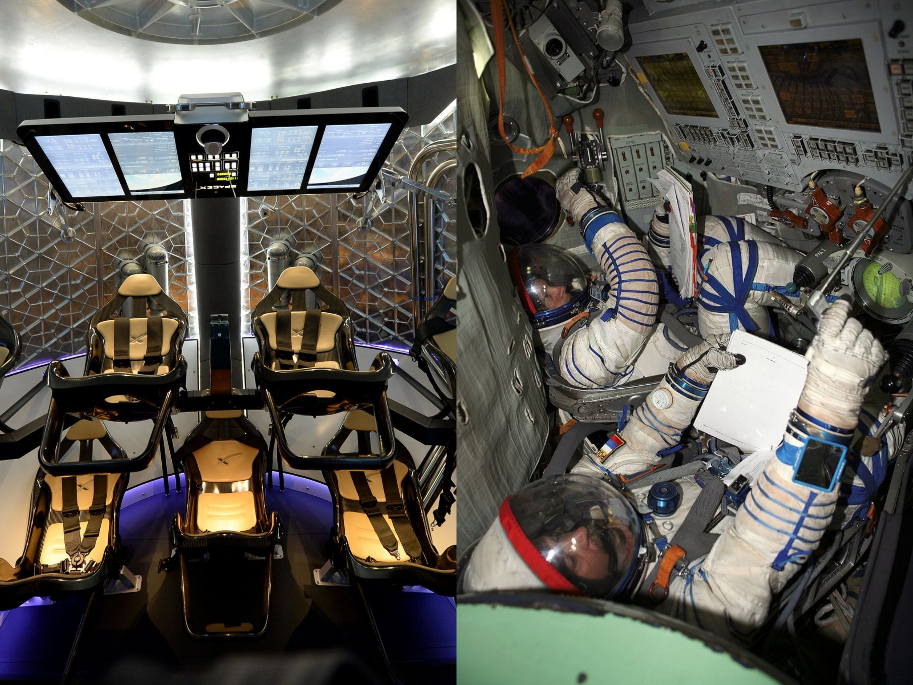

# The new Space race

I've been following the space industry for years, and I can tell you that what we're witnessing today bears little resemblance to the government-dominated Apollo era I grew up reading about. Where once rocket launches were rare, nationally televised events, we now see more than one launch per week from the United States alone. This transformation from the bipolar space race between the USA and USSR to today's multipolar, commercially-driven landscape represents what I believe is one of the largest shifts in aerospace history.

## The Technology Revolution

What strikes me most are the advances in propulsion technology: I love comparing SpaceX's _Merlin 1D_ engine with the Soviet-era _RD-170_. Both use the same basic propellant combination, refined petroleum and liquid oxygen, yet they represent what I see as entirely different philosophies of rocket design.

At first glance, their specific impulse (the rocket equivalent of fuel efficiency) appears similar. But when you dig deeper, the differences become stark. The _Merlin 1D_ delivers twice the thrust-to-weight ratio of its Soviet predecessor while being dramatically smaller and lighter. More importantly, it can restart mid-flight, a capability that is crucial for landing and reusability.

What I find most remarkable is that each _Merlin_ engine costs approximately $1 million to produce, a fraction of traditional rocket engine costs (The RS-25 costs more than $100M). This economic efficiency stems from modern manufacturing techniques, streamlined supply chains, and design philosophies that prioritize simplicity over complexity.

### The Reusability Game-Changer

In my opinion, **the most transformative innovation of the past two decades has been rocket reusability**. The Space Shuttle program attempted this concept but was hampered by its complexity and design compromises. Today's approach is elegantly different: traditional rocket stages that can autonomously navigate back to Earth and land with pinpoint precision on floating barges hundreds of kilometers downrange.

I remember when SpaceX first proposed landing rockets vertically —industry veterans dismissed it as impossible. Today, I see reusability as the competitive standard. Any company serious about cost-effective space access must either recover their boosters or risk being priced out of the market.

### Manufacturing Revolution

I've also observed how parallel advances in manufacturing have democratized rocket production. 3D printing enables rapid prototyping and reduces the extensive tooling traditionally required for rocket components. This technology arrived at what I think was the perfect moment: as manufacturing became more accessible, satellites simultaneously became smaller and more capable.

The rise of CubeSats —standardized satellites measuring just 2, 3, or 6 liters in volume— created demand for frequent, affordable small launchers. Companies like Rocket Lab build entire business models around serving this market, offering dedicated small-satellite launches at previously impossible price points.

I could mention other technological leaps: the shift toward methane-based propellants for better performance and reusability, the development of full-flow staged combustion engines for maximum efficiency, and advances in guidance and transmission systems that make precision landing routine rather than miraculous.

## The Political Dimension

Technology alone doesn't explains the transformation. Government policies and institutional approaches have played equally important roles—sometimes as catalysts, sometimes as obstacles.

### American Struggles and Adaptation

The Space Shuttle's retirement left NASA in an awkward position. After 30 years of shuttle operations—marked by extraordinary achievements but also tragic losses and escalating costs—America found itself dependent on Russian Soyuz rockets to reach the International Space Station.

NASA's response, the Space Launch System (SLS), illustrates what are both the promise and peril of government-led space programs. While technically ambitious, SLS has been constrained by political realities that prioritize job distribution across congressional districts over engineering efficiency. The result: a rocket that reuses Space Shuttle-era components like RS-25 engines and solid rocket boosters, technologies that, while proven, represent the previous generation of space technology.

This approach has created a paradox: a "new" rocket system that deliberately avoids the technological innovations driving the commercial space revolution. The contrast with SpaceX's iterative, performance-focused development approach could hardly be starker.

### Russian Decline

Russia's space program tells a different cautionary tale. Built on Soviet-era infrastructure and production lines, it maintained relevance through the reliable Soyuz system, which for nearly a decade was the only vehicle capable of carrying astronauts to the ISS.

However, geopolitical tensions have exposed critical vulnerabilities in that model. Many components for Russia's next-generation rockets were manufactured in Ukraine, while their primary launch facility remains in Kazakhstan. International sanctions and supply chain disruptions have left Russia's space program increasingly isolated, while its domestic investment in new technologies has lagged.

I find the technological gap becomes apparent when comparing spacecraft interiors—the contrast is striking to me.

### The New Paradigm

This shift has forced a fundamental reconsideration of government's role in space. NASA is increasingly acting as a customer rather than a manufacturer, purchasing services from commercial providers. This approach has proven both more cost-effective and more innovative than traditional government contracting.

The success has been so pronounced that there's serious discussion of canceling SLS entirely in favor of commercial alternatives for lunar missions, a remarkable reversal for an agency that once built everything in-house.

The new space economy also extends far beyond American and Russian players. China has emerged as a major space power with ambitious lunar and Mars programs. India has demonstrated remarkable cost efficiency, reaching Mars for less than the budget of a Hollywood blockbuster. I see private companies from dozens of countries now competing in markets that were unimaginable two decades ago.

With such a changing landscape, and the end of ISS closer each day, I can't stop wondering what the space industry will look like in a a few years.

---

_In my next article, I'll explore the darker side of this space renaissance: how increased launch activity and satellite proliferation are creating a growing space debris crisis that threatens the very accessibility that made this boom possible._
