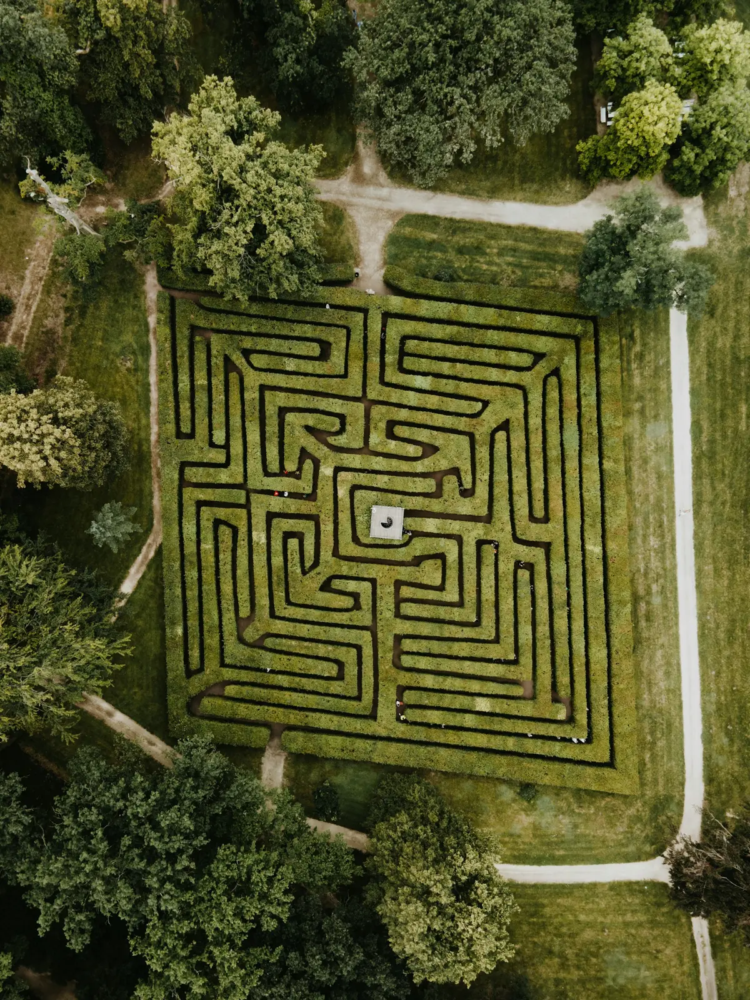

# The search for better search

At some point, the bottleneck became obvious. The evaluation was decent, the move generation was correct, but the engine couldn't look deep enough. Alpha-beta alone gets you to maybe depth 8-9 in a reasonable time. Beyond that, the branching factor kills you: there are roughly 30-35 legal moves per position, and each extra depth multiplies the work by that factor.

The path from "okay" to "respectable" in chess engines is almost entirely about searching deeper in the same amount of time. That means pruning (skipping branches that probably don't matter), reductions (searching some branches at reduced depth), and better move ordering (so the good moves get searched first).

## Iterative deepening

This one sounds wasteful: search to depth 1, then start over and search to depth 2, then start over and search to depth 3, and so on. You're redoing all that work each time.

Except you're not, really. Each iteration gives you a best move, which goes into the transposition table. The next iteration searches that move first, which makes alpha-beta pruning dramatically more effective. In practice, the time spent on depths 1 through N-1 is a small fraction of the time spent on depth N (because the tree grows exponentially). And you get a huge practical benefit: if time runs out, you always have a result from the last completed iteration.

## Aspiration windows

By default, alpha-beta searches with a window of negative infinity to positive infinity. **Aspiration windows** narrow that. Starting at depth 4, Oxide uses the previous iteration's score +/- 25 centipawns as the initial window. If the true score falls within that range, the search is much faster (tighter windows cause more cutoffs). If the score falls outside, the window widens and the search retries.

It fails occasionally, maybe 10-20% of the time, but the speedup on the successful cases more than compensates.

## The pruning zoo

Here's where things get dense. Each of these techniques has a one-line intuition and a set of conditions that determine when it's safe to apply.

**Null Move Pruning**: skip your turn entirely, then search at reduced depth. If you're still winning even after giving the opponent a free move, the position is probably so good that you don't need to search it fully. Reduction: `3 + depth/4`. Conditions: depth >= 3, not in check, side has non-pawn material (to avoid zugzwang).

**Reverse Futility Pruning**: if the static eval is far above beta (the opponent's threshold), don't bother searching. The margin is `80 * depth` centipawns. Applied at non-PV nodes, depth <= 7, not in check.

**Razoring**: the opposite direction. If the static eval is far *below* alpha at shallow depths (300 cp at depth 1, 600 cp at depth 2), drop straight into quiescence search. You probably can't recover.

**Futility Pruning**: at shallow depths, skip quiet moves where even with a bonus the score can't reach alpha. Margins: 200 cp (depth 1), 400 cp (depth 2). Only applied to quiet moves that aren't killers.

**Late Move Pruning (LMP)**: at shallow depths, after searching a certain number of quiet moves, stop. The moves at the tail of the move list are almost always bad. Thresholds: 3 moves at depth 1, 6 at depth 2, 10 at depth 3, 15 at depth 4.

**Late Move Reductions (LMR)**: moves searched later in the list get searched at reduced depth first. If they look promising (fail high), they're re-searched at full depth. The reduction is precomputed: `LMR[depth][move_num] = floor(ln(depth) * ln(move_num) / 2.0)`. Applied when moves_searched >= 3 and depth >= 3.

**SEE Pruning**: Static Exchange Evaluation estimates the outcome of a capture sequence. If a capture is a losing trade (e.g., trading your queen for a pawn), prune it. Applied to captures at depth <= 3 in the main search and in quiescence search.

**Delta Pruning**: in quiescence search, if capturing a piece plus a 200 cp bonus still can't reach alpha, skip the capture. It's not worth investigating.

## Move ordering: the silent multiplier

None of the above works well unless the *best* moves are searched first. Alpha-beta's efficiency depends on seeing good moves early: a perfect move ordering makes alpha-beta search O(b^(d/2)) instead of O(b^d).

Oxide's move ordering priority:

| Priority | Category | Score |
|----------|----------|-------|
| 1 | TT move | 1,000,000 |
| 2 | Captures (MVV-LVA) | 100,000 + victim*100 - attacker |
| 3 | Promotions | 100,000 + piece*100 |
| 4 | First killer move | 90,000 |
| 5 | Second killer move | 80,000 |
| 6 | Quiet moves (history) | history[from][to] |

The **TT move** comes from the transposition table: the best move found in a previous search of this position. It's almost always the best move to try first.

**MVV-LVA** (Most Valuable Victim, Least Valuable Attacker) orders captures by the value of the captured piece minus the value of the attacker. Capturing a queen with a pawn is searched before capturing a pawn with a queen.

**Killer moves** are quiet moves that caused beta cutoffs at the same ply in sibling nodes. They're not captures, but they've been good in similar positions. Two killers are stored per ply.

**History heuristic** is a `[64][64]` table indexed by from-square and to-square. When a quiet move causes a beta cutoff, its history score is incremented by `depth^2`. Over time, this learns which quiet moves tend to be good across the search.

Moves are sorted using **incremental selection sort**: instead of fully sorting all moves, you find the best one, search it, find the next best, search it, and so on. If you get a beta cutoff early, you never sort the rest of the list. This matters when a position has 30+ legal moves but the search cuts off after 3-4.

## The compound effect

No single technique here is dramatic on its own. Null move pruning might add 50-100 Elo. LMR might add another 50-100. Futility pruning, maybe 30. But they compound. Each technique lets the engine search deeper, which makes the other techniques more effective, which lets it search deeper still.

Going from a basic alpha-beta search to the full pruning stack took Oxide from searching depth 8-9 to depth 16-20 in the same time. That's the difference between an engine that misses tactics and one that sees them coming 8 moves out. It's the difference between 1200 Elo and 1900.

